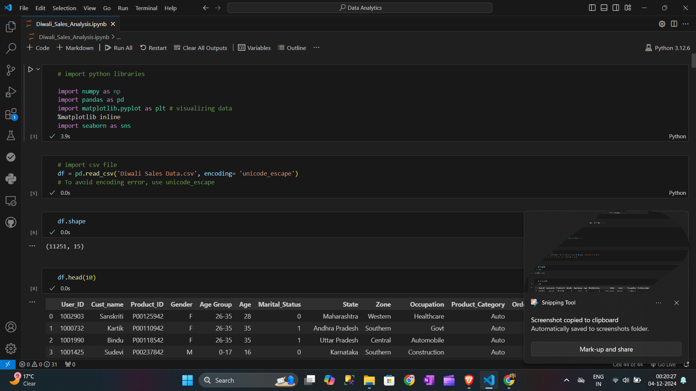

# Python_Diwali_Sales_Analysis
 "This project involves analyzing Diwali sales data to uncover customer behavior patterns and purchasing trends. The insights gained aim to enhance customer experience and develop effective strategies to boost sales. Through data-driven analysis, the project focuses on optimizing marketing efforts, identifying key customer segments, and driving overall business growth during the festive season."

 ## Screenshots

 

## Authors

- [@BadshahYadav](https://www.github.com/BadshahYadav)

- ## Support

For support, email badshahkumar1508@gmail.com 
Thanks for visiting our website. 

## 🔗 Links

